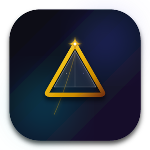

# 🌟 Zenith Player

<div align="center">
  
  
  <p><b>یک ویدیو پلیر مدرن، سریع و پر از امکانات برای دسکتاپ با طراحی چشم‌نواز Glassmorphism</b></p>  
  
  [](https://tauri.app/)
  []()
  []()
  []()
</div>

<br/>

**Zenith Player** یک پخش‌کننده ویدیوی پیشرفته دسکتاپ است که با استفاده از تکنولوژی‌های وب (HTML/CSS/JS) و فریم‌ورک قدرتمند **Tauri** (Rust) توسعه یافته است. این پلیر علاوه بر ارائه یک تجربه بصری فوق‌العاده، ابزارهای کاربردی و قدرتمندی مانند **پشتیبانی از زیرنویس همزمان (Dual Subtitles)**، **ویرایشگر تعاملی اسکرین‌شات و نقاشی**، **کنترل‌های زوم و جابجایی تصویر (Pan & Zoom)** و **سیستم بوک‌مارک پیشرفته** را در اختیار شما قرار می‌دهد.

> 🌐 **Language / زبان:** [English](./README.md)

---

## 💡 داستان پشت پروژه (Behind the Project)

> 🤖 **توسعه مبتنی بر هوش مصنوعی:**  
> این برنامه به صورت **۱۰۰٪ توسط هوش مصنوعی** و با هدایت، معماری و پرامپت‌نویسی مداوم من طی **چندین ماه** ساخته شده است. رسیدن به این سطح از امکانات و پایداری، مستلزم صدها مرحله ویرایش، دیباگ عمیق و برطرف کردن **صدها باگ پیچیده** بوده است. Zenith Player گواهی بر این است که با هدایت صحیح انسان، هوش مصنوعی می‌تواند ابزارهایی بسیار پیشرفته و کاربردی خلق کند!

---

## ✨ ویژگی‌های کلیدی (Key Features)

### 🎨 رابط کاربری و طراحی (UI & UX)
*   **طراحی Glassmorphism:** افکت شیشه‌ای زیبا و خیره‌کننده بر اساس استانداردهای مدرن طراحی (مشابه Video.js v10).
*   **تم تاریک و روشن (Dark / Light Mode):** تغییر هوشمند تم با کلیک و انطباق کامل رنگ‌های بخش‌های مختلف.
*   **پس‌زمینه پویا (Dynamic Ambient Orbs):** افکت‌های نوری و متحرک در پس‌زمینه برای جذابیت بیشتر بصری.
*   **نمایشگر شناور پیش‌نمایش:** نمایش پیش‌نمایش تصویر (Thumbnail) و زمان دقیق روی نوار پیشرفت با نگه داشتن موس.

### 🎬 پخش و کنترل ویدیو
*   **پخش فایل‌های محلی و آنلاین:** پخش فایل‌ها با کشیدن و رها کردن (Drag & Drop) یا وارد کردن لینک مستقیم (URL).
*   **کنترل سرعت هوشمند:** تنظیم دقیق سرعت پخش ویدیو تا **10x**.
*   **زوم و جابجایی تصویر (Pan & Zoom):** بزرگ‌نمایی، کوچک‌نمایی و جابجایی فریم ویدیو با کلیدهای Numpad یا اسکرول موس.
*   **فیلترهای رنگی:** اعمال فیلترهای رنگی Luma و Invert روی ویدیو و اسکرین‌شات‌ها.
*   **ادامه پخش (Resume Playback):** ذخیره خودکار آخرین ثانیه پخش و پیشنهاد ادامه آن در اجرای بعدی.
*   **پنجره در پنجره (Picture-in-Picture):** تماشای ویدیو در یک پنجره کوچک، شناور و مستقل.

### 📝 سیستم زیرنویس پیشرفته
*   **پشتیبانی از فرمت‌های SRT, VTT, ASS:** پردازش فوق‌سریع زیرنویس‌ها با بهره‌گیری از Web Workers.
*   **زیرنویس دوگانه (Dual Subtitles):** نمایش همزمان دو زیرنویس (مثلاً فارسی و انگلیسی) به صورت مجزا در بالا و پایین تصویر.
*   **شخصی‌سازی کامل:** تغییر اندازه فونت، رنگ، پس‌زمینه (شیشه‌ای، مشکی، آبی و...) و جهت متن (RTL/LTR) برای هر زیرنویس به صورت مستقل.
*   **انتخاب هوشمند:** تشخیص و بارگذاری خودکار فایل زیرنویس هم‌نام با ویدیو.

### 📸 اسکرین‌شات و ابزار نقاشی (Drawing Tools)
*   **گرفتن اسکرین‌شات باکیفیت:** ثبت تصویر از ویدیو به همراه زیرنویس‌های فعال روی فریم.
*   **ابزار برش زنده (Crop):** قابلیت برش تعاملی تصویر قبل از ذخیره‌سازی.
*   **ویرایش و نقاشی روی تصویر:** ابزارهای مداد، پاک‌کن، خط، فلش، مستطیل، دایره و مثلث با امکان انتخاب رنگ و ضخامت خط.
*   **تاریخچه تغییرات (Undo / Redo):** پشتیبانی کامل از بازگشت یا انجام مجدد خطوط کشیده شده.
*   **خروجی سریع:** کپی مستقیم تصویر ویرایش‌شده در کلیپ‌بورد (Clipboard) یا ذخیره به صورت فایل PNG.

### 🔖 بوک‌مارک، تاریخچه و پلی‌لیست
*   **سیستم بوک‌مارک تعاملی:** ثبت زمان‌های دلخواه با برچسب سفارشی و نمایش نشانگر آن‌ها روی نوار پیشرفت.
*   **پنل پلی‌لیست:** مدیریت لیست پخش با قابلیت تغییر عرض پنل.
*   **تاریخچه ویدیوهای آنلاین:** ذخیره خودکار لینک‌های پخش‌شده برای دسترسی سریع در آینده.

---

## ⌨️ کلیدهای میانبر (Keyboard Shortcuts)

تمامی بخش‌های Zenith Player برای راحتی کاربران حرفه‌ای از طریق کیبورد قابل کنترل هستند.

### کنترل پخش (Playback Controls)
| کلید میانبر | عملکرد |
| :--- | :--- |
| `Space` | پخش / مکث (Play / Pause) |
| `Arrow Right` | پرش به ۵ ثانیه جلوتر |
| `Arrow Left` | پرش به ۵ ثانیه عقب‌تر |
| `Arrow Up` | افزایش صدا |
| `Arrow Down` | کاهش صدا |
| `C` | افزایش سرعت پخش (+0.1) |
| `X` | کاهش سرعت پخش (-0.1) |
| `Y` | بازنشانی سرعت به 1.0x (یا سوئیچ به سرعت قبلی) |
| `B` | پخش ویدیوی بعدی در پلی‌لیست |
| `N` | پخش ویدیوی قبلی در پلی‌لیست |

### کنترل تصویر و رابط کاربری (Video & UI Controls)
| کلید میانبر | عملکرد |
| :--- | :--- |
| `F11` | حالت تمام‌صفحه (Fullscreen) |
| `P` | باز / بستن پنل بوک‌مارک‌ها |
| `Ctrl + P` | فعال / غیرفعال کردن حالت PIP (Picture in Picture) |
| `Numpad 8 / 2 / 4 / 6` | تغییر مقیاس (زوم) ویدیو در جهت‌های X و Y |
| `Ctrl + Numpad 8 / 2 / 4 / 6` | جابجایی (Pan) تصویر ویدیو به بالا، پایین، چپ و راست |
| `Numpad 5` | بازنشانی زوم و جابجایی تصویر به حالت اولیه |
| `Ctrl + Alt + Arrow Up / Down` | تنظیم حاشیه پایین (Bottom Margin) نوار کنترل |
| `Ctrl + Alt + + / - / =` | بزرگ‌نمایی / کوچک‌نمایی نوار کنترل پایین |
| `Ctrl + Shift + + / - / =` | بزرگ‌نمایی / کوچک‌نمایی پنل تنظیمات |
| `<` و `>` (کاما و نقطه) | **بازنشانی تمام مقیاس‌های پنل‌ها به حالت پیش‌فرض** |

### کنترل زیرنویس‌ها (Subtitle Controls)
| کلید میانبر | عملکرد |
| :--- | :--- |
| `=` / `+` | افزایش اندازه فونت **زیرنویس اول (پایین)** |
| `-` (منها) | کاهش اندازه فونت **زیرنویس اول (پایین)** |
| `Shift + =` / `Shift + +` | افزایش اندازه فونت **زیرنویس دوم (بالا)** |
| `Shift + -` | کاهش اندازه فونت **زیرنویس دوم (بالا)** |
| `Ctrl + Arrow Keys` | جابجایی موقعیت **زیرنویس اول** روی صفحه |
| `Ctrl + Shift + Arrow Keys`| جابجایی موقعیت **زیرنویس دوم** روی صفحه |
| `[` و `]` | **بازنشانی موقعیت و اندازه هر دو زیرنویس به حالت پیش‌فرض** |

### بوک‌مارک‌ها (Bookmarks)
| کلید میانبر | عملکرد |
| :--- | :--- |
| `K` | افزودن بوک‌مارک در زمان فعلی (همراه با کادر نام‌گذاری) |
| `L` | حذف بوک‌مارک موجود در زمان فعلی |

### اسکرین‌شات و ابزار نقاشی (Screenshot & Drawing)
| کلید میانبر | عملکرد |
| :--- | :--- |
| `S` | ثبت اسکرین‌شات و باز شدن ویرایشگر تصویر |
| `Escape` | خروج از حالت نقاشی / خروج از برش (Crop) / بستن پنجره |
| `Enter` | تایید و اعمال نقاشی یا برش تصویر |
| `Ctrl + Z` | بازگشت (Undo) آخرین خط کشیده شده |
| `Ctrl + Y` یا `Ctrl + Shift + Z` | انجام مجدد (Redo) آخرین تغییر |

---

## 🚀 نحوه نصب و اجرا (Installation & Setup)

از آنجایی که این پروژه با استفاده از **Tauri** ساخته شده است، برای اجرا یا بیلد آن به پیش‌نیازهای زیر نیاز دارید:
1. [Node.js](https://nodejs.org/) (نسخه 16 به بالا)
2. [Rust](https://www.rust-lang.org/)
3. ابزارهای توسعه سیستم‌عامل (C++ Build tools در ویندوز، `webkit2gtk` در لینوکس و...)

### مراحل اجرا در محیط توسعه:
```bash
# ۱. کلون کردن مخزن پروژه
git clone https://github.com/your-username/zenith-player.git
cd zenith-player

# ۲. نصب وابستگی‌های Node
npm install

# ۳. اجرای برنامه در حالت توسعه (Development)
npm run tauri dev

# ۴. ساخت نسخه نهایی (Build)
npm run tauri build
